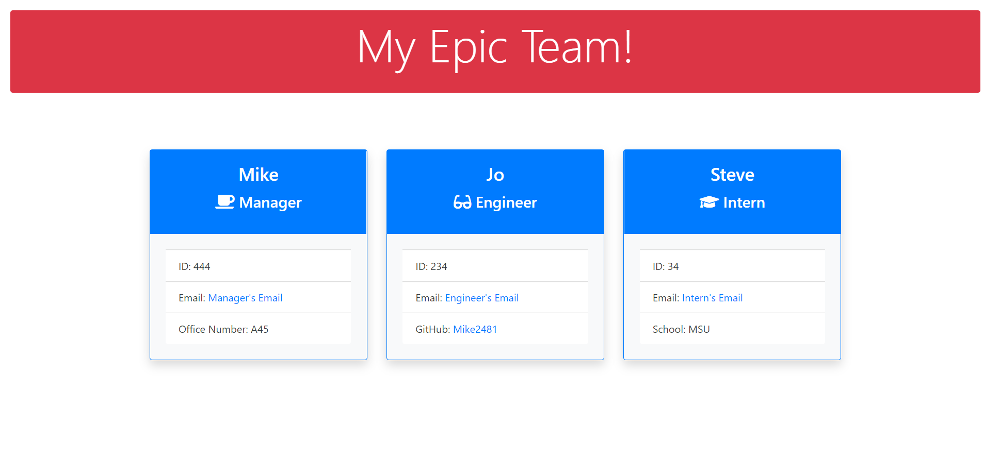

# Epic Team Roster Generator

## Description

This node project utilizes OOP, along with inquirer, and jest to test and create code that utilizes user input to create a stunning HTML page. 

## Table of Contents

*[Installation](#installation)

*[Usage](#usage)

*[License](#license)

*[Contributing](#contributing)

*[Tests](#tests)

*[Questions](#questions)

## Installation

From the command line, run npm init to ensure all dependencies are loaded, then run node index to initiate the prompts

## Usage

The prompts will walk you through generating all the required data.  Manager name, id, email, and office number are required to set up the Manager card.  Then you will select either engineer or intern, and answer the questions for that specific employee.  For engineer, you will be asked for a github username.  For intern, you will be asked for the interns school.  After completing the employee questions, you will be asked to add another employee or be done building your team.  Once you select that you're finished, an HTML page will be generated with all the data you provided.  Email links will open your default email app with mailto, and the github link will deploy a new tab with that users github page being displayed

## License
This application is covered under the [MIT](./License/MIT.txt) license.
  
## Contributing

Pull requests are welcome. For major changes, please open an issue first to discuss what you would like to change.

## Tests

There are 4 test suites and 19 total tests written to test all constructors and methods

## Questions

If you have any questions, please contact me by [email](vprmatrix55@gmail.com) or through [Github](https://github.com/Mike2481)

